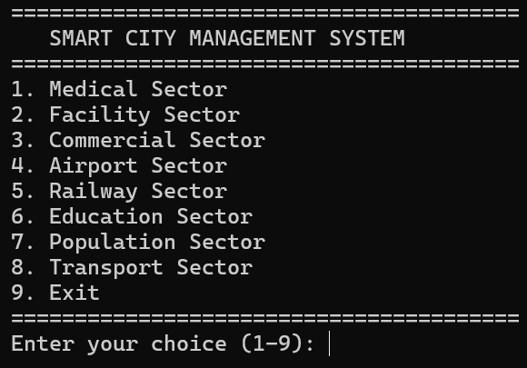
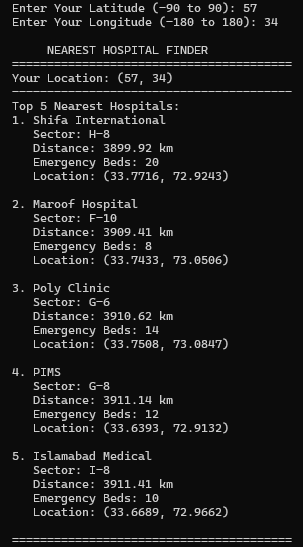
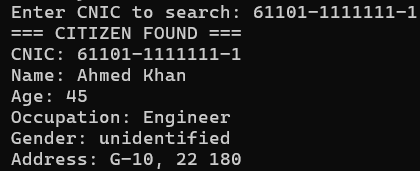
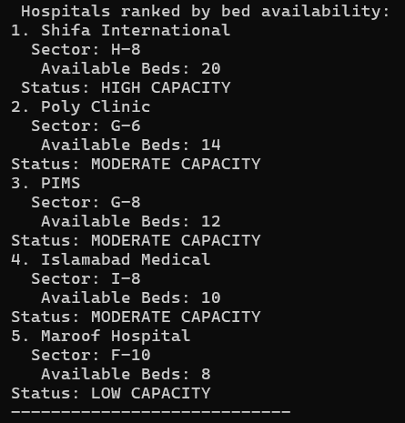
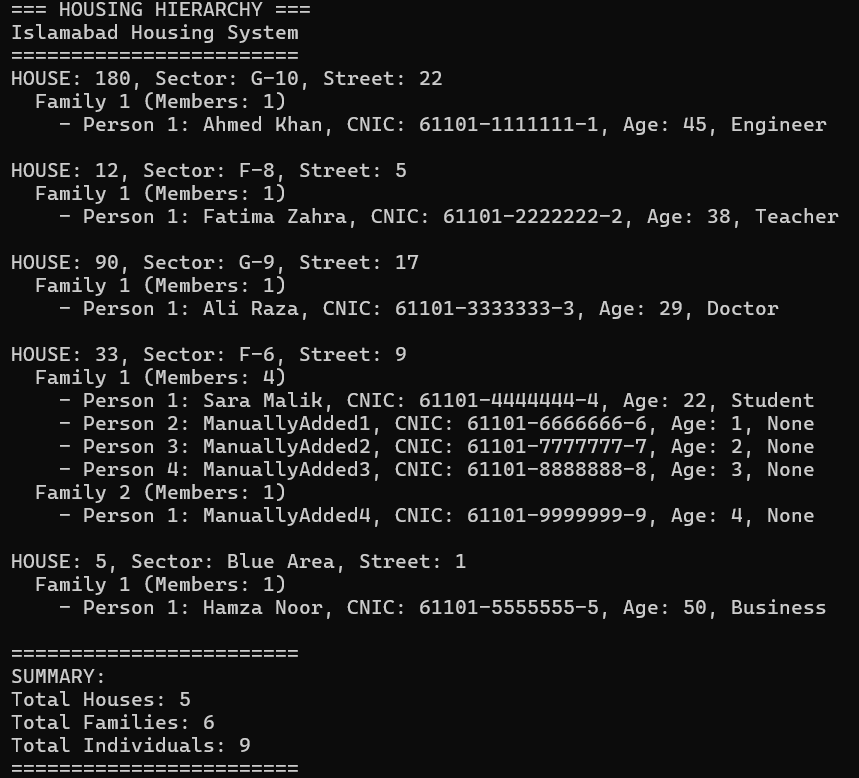

# Smart City Management System (Advanced Data Structures Showcase)

> A comprehensive, console-based **Smart City simulation** built in **C++**, showcasing real-world, rigorous implementation of **core Data Structures and Algorithms** — fully implemented **from scratch** without relying on restricted STL containers.

This project is designed to feel less like an assignment and more like a **mini infrastructure engine** for a city.

---

## 📌 Project Overview

The **Smart City Management System** models Islamabad as a digital ecosystem where different urban sectors interact through well-designed data structures. Each module is engineered to demonstrate how software systems internally depend on data structures for performance, organization, and scalability.

The project integrates:

* 🚍 Transport & Navigation System
* 🎓 Education Management
* 🏥 Medical & Emergency Services
* 🛒 Commercial & Malls
* 🌳 Public Facilities
* 🏘 Population & Housing
* ✈️ Airport & Railway

This is not a mock demo — it is a **full DS engineering project**.

---

## 🎯 Core Goals of the Project

* Apply **data structures exactly where they logically belong** in real systems
* Demonstrate **manual implementation** of DS (no shortcuts via STL where restricted)
* Build a modular system using **OOP principles**
* Showcase mastery over:

  * Memory management
  * Time complexity
  * Data organization
  * Algorithmic thinking

---

## 🧠 Data Structures Implemented (All Manual)

Every structure below is implemented manually in the codebase:

| Data Structure                 | Implementation Evidence | Where Used                              |
| ------------------------------ | ----------------------- | --------------------------------------- |
| Graph (Adjacency List)         | `Graph.h`               | City map, navigation, nearest search    |
| Dijkstra Algorithm             | `Graph.h`               | Shortest path computation               |
| Hash Table (Separate Chaining) | `HashTable.h`           | CNIC lookup, buses, medicines, products |
| Singly Linked List             | `LinkedList.h`          | Bus routes, chaining in hash            |
| Circular Queue                 | `Queue.h`               | Passenger simulation                    |
| Stack                          | `Stack.h`               | Route history tracking                  |
| Binary Min Heap                | `MinHeap.h`             | School ranking, nearest selection       |
| Binary Max Heap                | `MaxHeap.h`             | Emergency hospital prioritization       |
| General Tree (N-ary)           | Sector modules          | Education, population hierarchy         |

No built-in replacements like `unordered_map`, `priority_queue`, etc. are used where restricted.

---

## 🗂 Actual Project Structure

```
SmartCityManagementSystem/
│
├── main.cpp                 # Entry point, menu, user navigation
├── SmartCity.h              # Master controller integrating all modules
│
├── Graph.h                  # Adjacency list + Dijkstra algorithm
├── HashTable.h              # Custom hash + separate chaining
├── LinkedList.h             # Singly linked list implementation
├── Stack.h                  # Stack (manual implementation)
├── Queue.h                  # Circular queue implementation
├── MinHeap.h                # Binary min heap (priority queue)
├── MaxHeap.h                # Binary max heap (emergency system)
│
├── TransportSector.h        # Bus system, routing, tracking
├── EducationSector.h        # School tree, students, ranking
├── MedicalSector.h          # Hospitals, beds, pharmacies
├── CommercialSector.h       # Mall & product system
├── Facilities.h             # Parks, mosques, public nodes
├── PopulationSector.h       # Citizens, families, CNIC hashing
├── AirportSector.h          # Optional module
├── RailwaySector.h          # Optional module
│
├── Utilities.h              # Input handling, formatting, time logic
```

---

## 🔍 Deep Implementation Details

### 1. Graph System (`Graph.h`)

* Graph implemented using **adjacency list**
* Each node represents a real city location (stop, hospital, mall, etc.)
* Each edge stores:

  * Destination node
  * Weight (distance)

Dijkstra Algorithm:

* Fully implemented manually
* Uses distance arrays
* Iteratively selects minimum distance node
* Computes optimal path between any two locations

Used for:

* Shortest route between locations
* Nearest hospital
* Nearest bus stop
* Nearest mall / school

Complexity:

* O((V + E) log V)

---

### 2. Hash Table (`HashTable.h`)

* Manual hash function (modular arithmetic based)
* Uses **separate chaining with singly linked lists**
* Collision handling implemented explicitly

Used for:

* Citizens via CNIC
* Bus lookup via bus number
* Medicine lookup
* Product lookup

Complexity:

* Average: O(1)
* Worst: O(n)

---

### 3. Linked List (`LinkedList.h`)

* Singly linked list
* Used in two critical places:

  * Bus route storage (ordered stops)
  * Hash table collision chains

Operations implemented:

* Insert
* Delete
* Traverse
* Search

---

### 4. Heap System (`MinHeap.h` & `MaxHeap.h`)

Binary heap stored using array-based structure:

MinHeap used for:

* Ranking schools
* Finding nearest entities

MaxHeap used for:

* Emergency bed prioritization
* Hospital load management

Manual implementation includes:

* Heapify up
* Heapify down
* Insert
* Extract min/max

---

### 5. Queue (`Queue.h`)

* Implemented as **circular queue**
* Used to simulate:

  * Passenger handling system

Includes:

* Front/rear management
* Overflow/underflow handling

---

### 6. Stack (`Stack.h`)

* Manual implementation
* Used for:

  * Route navigation history
  * Undo-style traversal

---

### 7. Tree Structures (Across Modules)

Trees are used logically, not artificially:

EducationSector:

* School → Department → Class → Students

PopulationSector:

* Sector → Street → House → Family → Individual

These are **N-ary trees**, not binary, as required.

---

## ⏱ Custom Time & Date System (Algorithmic Implementation)

Instead of using ready-made date libraries, this project demonstrates algorithmic handling of time:

* System time fetched as **seconds since Unix Epoch (1 Jan 1970)**
* Seconds are manually converted into:

  * Years
  * Months
  * Days
  * Hours
  * Minutes
  * Seconds

Logic handles:

* Leap year calculation
* Variable month lengths
* Accurate formatting for logs and outputs

This feature is intentionally implemented to demonstrate **low-level algorithmic thinking instead of dependency on libraries**.

---

## 🧩 Sector-Wise Functional Breakdown

### 🚍 Transport Sector

* Bus registration
* Route stored as linked list
* Stops stored as graph nodes
* Dijkstra for shortest route
* Hash table for bus lookup
* Stack for route history

### 🎓 Education Sector

* Tree-based education hierarchy
* School ranking using heap
* Subject search
* Nearest school using graph

### 🏥 Medical Sector

* Hospital database
* Emergency bed system using max heap
* Pharmacy medicine storage using hash table
* Nearest hospital search

### 🛒 Commercial Sector

* Mall system
* Products stored via hashing
* Category search
* Nearest mall using graph

### 🏘 Population Sector

* Citizens stored via CNIC hashing
* Family tree generation
* Population reports:

  * Age distribution
  * Occupation summary
  * Gender ratio
  * Density

---

## 📊 Complexity Awareness

The project consciously applies complexity analysis:

| Operation       | Structure        | Complexity |
| --------------- | ---------------- | ---------- |
| Search Citizen  | Hash Table       | O(1) avg   |
| Shortest Route  | Graph + Dijkstra | O(E log V) |
| Rank Hospital   | Heap             | O(log n)   |
| Insert Bus Stop | Linked List      | O(n)       |
| Tree Traversal  | N-ary Tree       | O(n)       |

---

## 🛠 How to Run

```bash
git clone https://github.com/mughees-tariq/SmartCityManagementSystem.git
cd SmartCityManagementSystem

g++ *.cpp -o smartcity
./smartcity
```

Compatible with:

* Windows (CodeBlocks / Visual Studio)
* Linux (g++)

---

## 🧭 Menu Flow Walkthrough (User Experience)

The system follows a structured, interactive menu-driven flow that reflects real-world modular software.

**Typical Execution Flow:**

1. Program starts → Main Smart City Dashboard

2. User selects a sector:

   * Transport Sector
   * Education Sector
   * Medical Sector
   * Commercial Sector
   * Population & Housing
   * Public Facilities
   * Airport / Railway

3. Each sector opens its own dedicated menu, for example:

**Transport Sector Menu:**

* Add Bus
* Add Stop
* Connect Stops (Graph Edge)
* Display Route (Linked List)
* Find Shortest Path (Dijkstra)
* Search Bus (Hash Lookup)
* View Route History (Stack)

**Education Sector Menu:**

* Register School
* Add Departments / Classes
* Enroll Students
* Rank Schools (Heap)
* Search by Subject
* Find Nearest School

**Medical Sector Menu:**

* Register Hospital
* View Emergency Bed Priority (Max Heap)
* Add Pharmacy Medicines
* Search Medicine (Hash)
* Find Nearest Hospital

This structured flow makes the system intuitive while clearly demonstrating how each data structure is actually used in practice.

---

## 🖼 Screenshots

### Main Menu


### Shortest Path (Dijkstra)


### Hash Table Lookup


### Heap Ranking System


### Tree Hierarchy Display


---

## 👨‍💻 Developer

**Muhammad Mughees Tariq Khawaja**
[LinkedIn](https://linkedin.com/in/mugheestariq)

---

## ⭐ Final Note

This project is intentionally built to be **readable, analyzable, and technically impressive**.
If you explore the code, every structure and algorithm can be traced clearly.

> This is not just a project. This is a **Data Structures engineering demonstration**.
